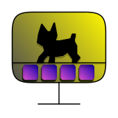

<p align="center"></p>

# DeskMate 🖥️

A little DeskMate walking around on your Dock or Taskbar.

<sub>Might rename it tho</sub>

## Goal of this Project 🎯
Mainly I wanted to learn QT(GUI Dev) and well deepen my knowledge in Pygame, but all of a sudden I had quite the motivation and wanted to create a project that goes bigger. Teaches about maintaining and making a project.

## Roadmap 🗺️
- [X] Basic function of an object going left and right
- [X] Sprite changing when hitting the wall
- [X] Automatic updater
- [X] GUI Menu
- [X] Updater in the GUI menu
- [X] Functional Sprite slicer
- [ ] proper installer for ease of use
- [ ] Height picker for like Dock or Taskbar

## Installation 📥
Linux🐧/Mac🍎 
Using uv
```bash
uv venv .venv
# depending on shell this works for zsh(might update for all shells gotta see)
source .venv/bin/activate

uv pip install -r requirenments.txt
```
[./README.md](Other things I wanna do)
